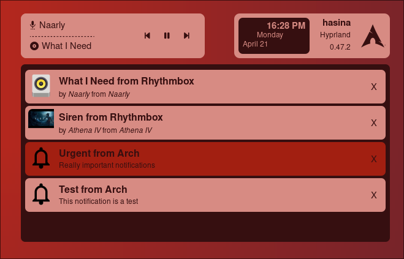

# notifyuck
Notifyuck is a C program that can be used to create a notification center for Eww.
I've saw a lot of cool ricing on Hyprland with Eww, that got their own notification center.
Implementing it can be quite complex specially for people not really used with script and unix.
So I decided to create this simple user-friendly program so you can also easily implement a notification center in your rice!!!

## Dependencies
You need to have dunst as your notification manager. Other notification manager are not supported for the moment.
Obviously you need to have Eww installed also.

## Example Of Output

